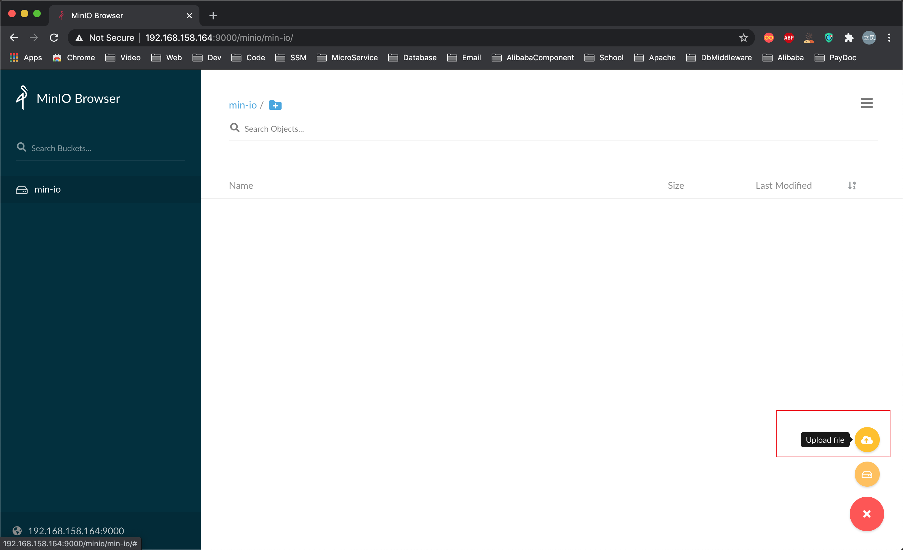
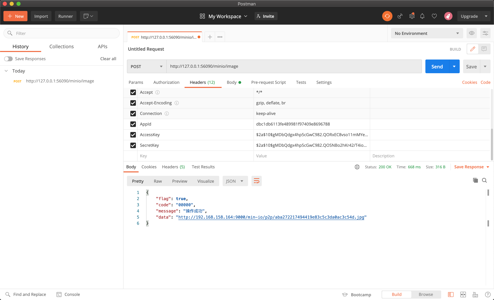
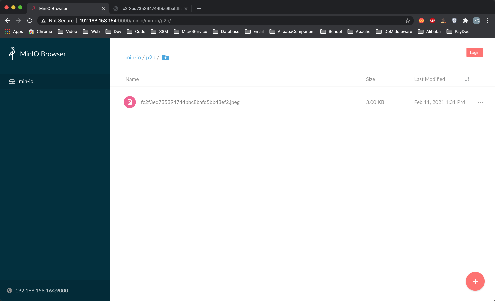
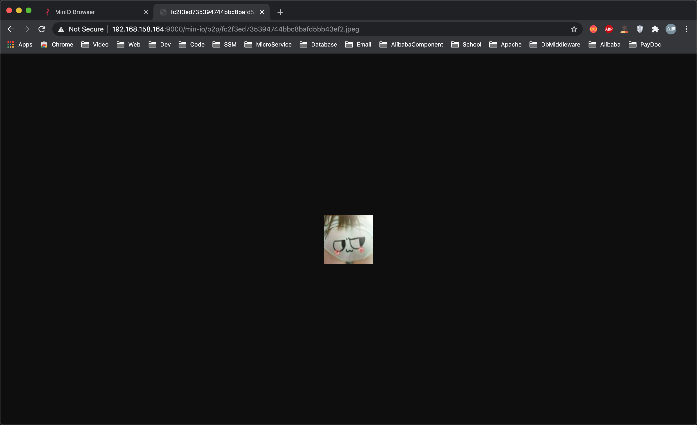
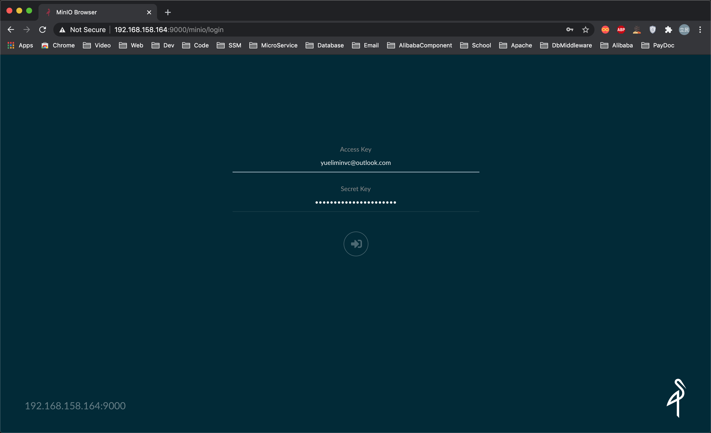
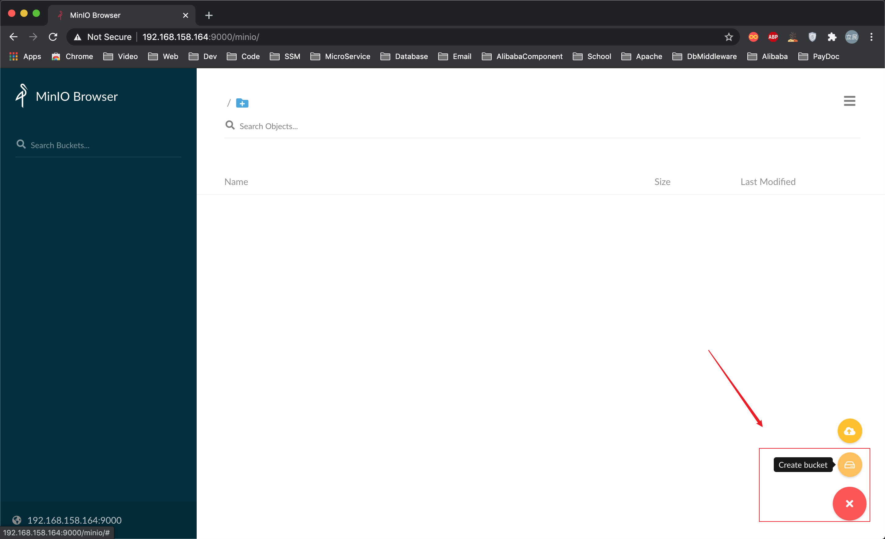
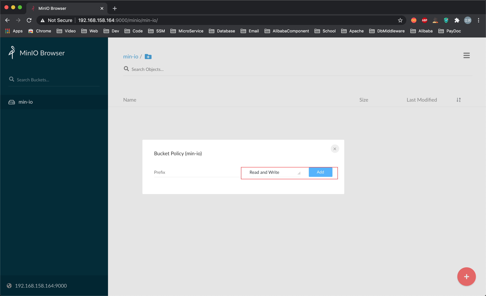

# MinIo(文件上传)

[](https://github.com/mikuhuyo/minio/blob/master/LICENSE)
[](https://github.com/mikuhuyo/minio/issues)
[](https://github.com/mikuhuyo/minio/stargazers)
[](https://github.com/mikuhuyo/minio/network)


---

## 预备知识点

- Redis
- Swagger
- SpringBoot
- MinIO
- SpringTask
- 落魄程序员

## 本仓库

### 关注

[](https://github.com/mikuhuyo/minio/stargazers)

### 收藏

[](https://github.com/mikuhuyo/minio/network/members)

## 功能演示

### MinIO上传文件




### SpringBoot上传文件







## 环境搭建

### 创建Docker容器

```shell script
# 拉取镜像
docker pull mysql:5.7

# 创建容器
docker run --name mysql \
--privileged=true \
-p 3306:3306 \
-e MYSQL_ROOT_PASSWORD=yueliminvc@outlook.com \
-d mysql:5.7
```

```shell script
docker pull redis:4

docker run --name redis -p 6379:6379  \
-d redis:4 \
--requirepass "yueliminvc@outlook.com" \
--appendonly yes
```

```shell script
docker pull minio/minio

mkdir -p /root/docker/minio/data
mkdir -p /root/docker/minio/config

docker run -id -p 9000:9000 --name minio \
--privileged=true \
-e "MINIO_ACCESS_KEY=yueliminvc@outlook.com" \
-e "MINIO_SECRET_KEY=yueliminvc@outlook.com" \
-v /root/docker/minio/data:/data \
-v /root/docker/minio/config:/root/.minio \
minio/minio server /data
```

### 创建MinIO存储空间








## 启动手册

在请求头中添加`AccessKey`, `SecretKey`与`AppId`字段, 根据`Swagger`接口文档获取.

如果想要关闭请求头校验就将`WebMvcConfig`中的拦截器注释掉.

修改`application-dev.yml`文件中的`minio`, `mybatis-plus`与`redis`部分配置就好了.

## 常见问题

```shell script
error occurred
ErrorResponse(code = AccessDenied, message = Access denied, bucketName = min-io, objectName = null, resource = /min-io, requestId = null, hostId = null)

# 01.时区问题, 需要同步时间(服务器与本地进行同步).
# 02.秘钥问题, 检查您的秘钥是否正确.

```
