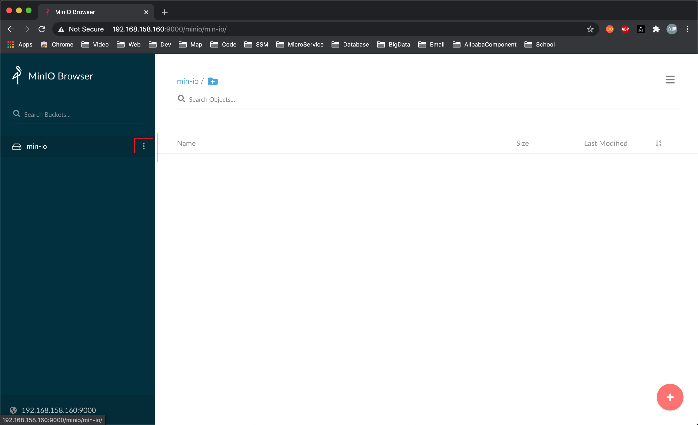
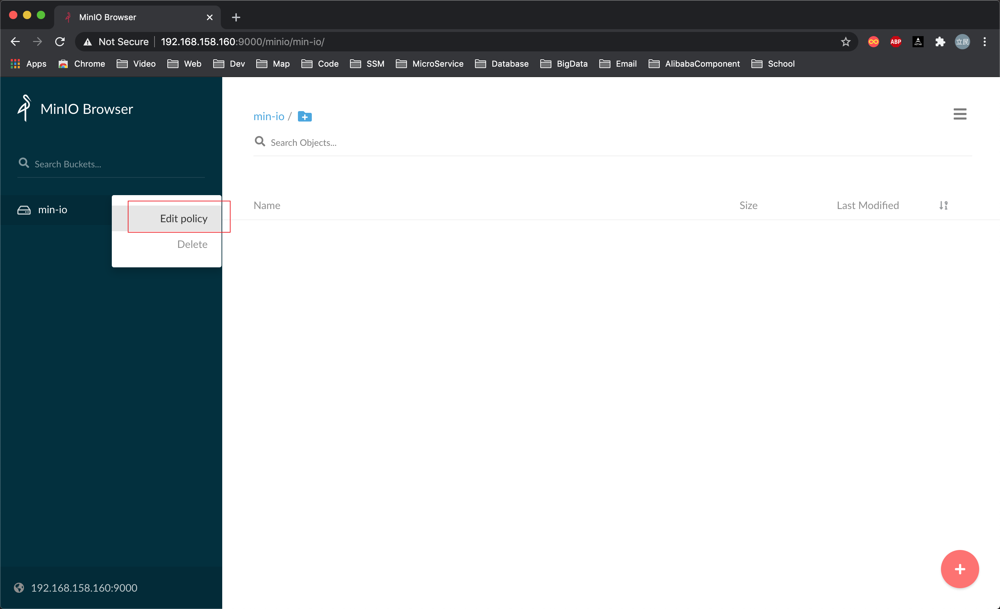
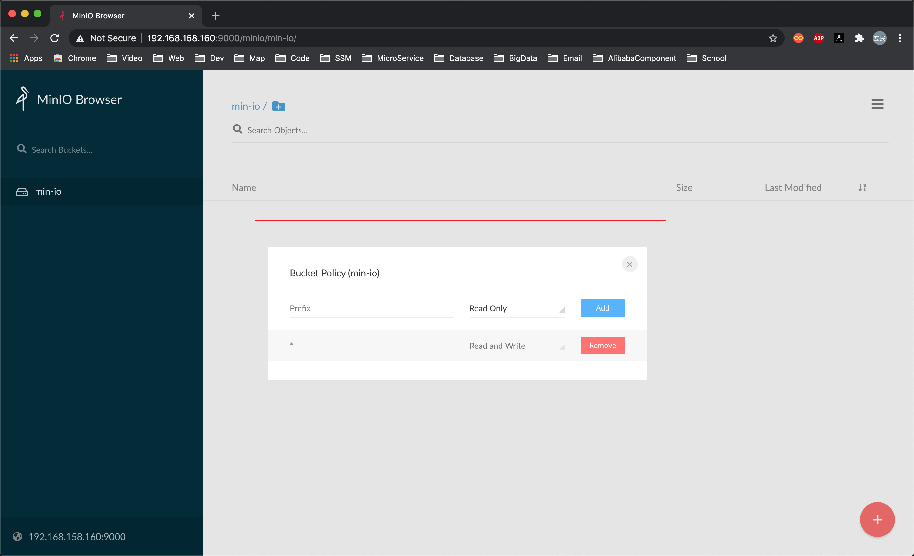

# MinIo
使用SpringBoot搭建的一个MinIo上传服务.

## 基本环境配置

### 使用docker创建容器

```shell script
docker pull redis:4

docker run --name redis -p 6379:6379  \
-d redis:4 \
--requirepass "yueliminvc@outlook.com" \
--appendonly yes
```

```shell script
docker pull minio/minio

mkdir -p /root/docker/minio/data
mkdir -p /root/docker/minio/config

docker run -id -p 9000:9000 --name minio \
--privileged=true \
-e "MINIO_ACCESS_KEY=yueliminvc@outlook.com" \
-e "MINIO_SECRET_KEY=yueliminvc@outlook.com" \
-v /root/docker/minio/data:/data \
-v /root/docker/minio/config:/root/.minio \
minio/minio server /data
```

### MinIO容器说明

使用`docker`创建`minio`容器的时候需要注意将新建的同设置为可读可写.







## 使用说明

在使用前最好具备Redis, SwaggerUI, SpringBoot, SpringTask基础.

### 在线查看API文档

> http://127.0.0.1:9002/minio/swagger-ui.html

### 修改配置

关于redis, minio的配置, 道友们只需要将`resources/application.yml`配置文件中的配置参数修改一下就可以了.
